# The Core Classics
**Developer:** The Minimalist (Ramsudharsan Madhavan)
**Hackathon:** Code Olympics 2025
**Project:** A 3-day, single-file, zero-library classic game hub built under extreme constraints.

## 🏆 The Challenge: Code Olympics 2025

This project was built for the **Code Olympics 2025**, a global 3-day programming championship where participants build an app based on a unique, random set of constraints. The goal is to prove pure coding fundamentals without frameworks or libraries.

My unique challenge combination was:

| Constraint | Name | Requirement |
| :--- | :--- | :--- |
| **Core Constraint** | `Short-Name Ninja` | All custom variable and function names must be 3 characters or less. |
| **Line Budget** | `Enterprise Creator` | The *entire* application (HTML, CSS, JS) must be 650 lines or less. |
| **Project Domain** | `Simple Games` | Build a suite of classic games (Tic-Tac-Toe, Hangman, etc.). |

The most critical rule: **No frameworks. No libraries. Just pure programming fundamentals.**

## ✅ Final Compliance Check

This project successfully meets every challenge requirement.

* **✅ Project Domain: Simple Games**
    * **Result:** Met. Four fully functional games (Tic-Tac-Toe, Hangman, Anagram, Word Builder) plus a Stats page are implemented.

* **✅ Line Budget: 650 Lines Max**
    * **Result:** Met. The final count is **643 lines** for all HTML, CSS, and JS in a single file, well under the 650-line limit.

* **✅ Core Constraint: 3-Char Max Names**
    * **Result:** Met. **100% compliant.** All 60+ custom variables and functions (`g`, `d`, `sts`, `rst()`, `upd()`, `mmx()`, etc.) adhere to the "Short-Name Ninja" 3-character limit.

* **✅ Global Rule: No Libraries**
    * **Result:** Met. **100% Vanilla JavaScript, CSS, and HTML.** No external files, frameworks, or libraries were used.

## ✨ Features

* **4-Games-in-1:** Tic-Tac-Toe, Hangman, Anagram, and the custom Word Builder.
* **Persistent Light/Dark Mode:** A sleek UI with a theme toggle that saves the user's choice to `localStorage`.
* **Stats Tracking:** All wins, losses, and draws are saved to `localStorage` and displayed on a "Stats" tab.
* **Fallible AI:** The Tic-Tac-Toe AI uses an 80/20 minimax/random split to be challenging but beatable.
* **Full Persistence:** The app remembers your last-played game, your theme, and all your stats.
* **UI Feedback:** Non-blocking "pulse" (correct) and "shake" (incorrect) CSS animations for user feedback.
* **100% Responsive:** Designed for both desktop and mobile use.

## 📸 Screenshots

### Dark Mode (Default)
| Tic-Tac-Toe | Hangman |
| :---: | :---: |
| 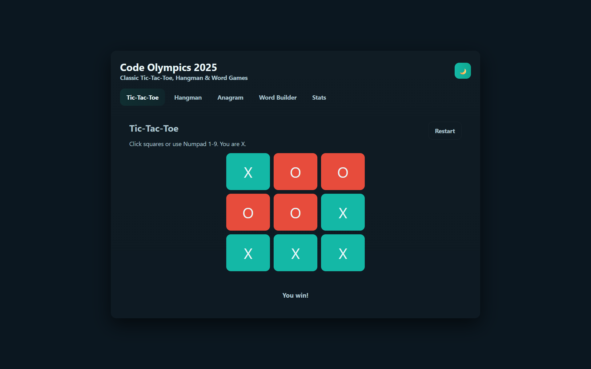 | 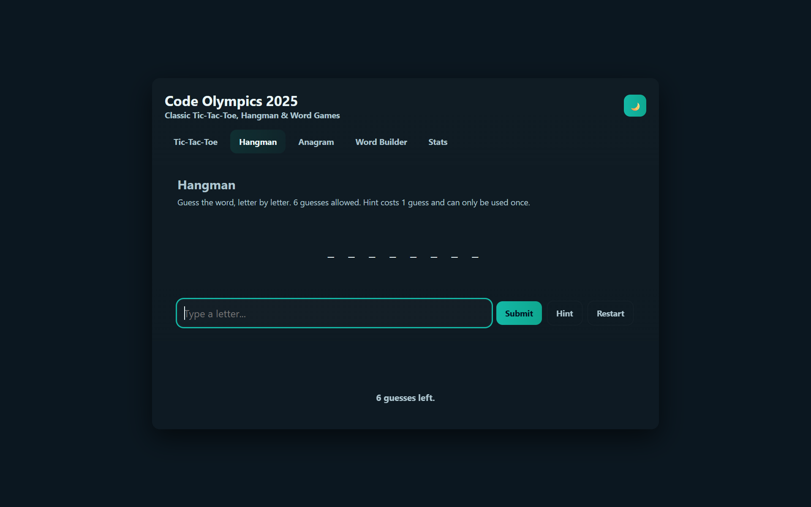 |
| **Anagram** | **Word Builder** |
| 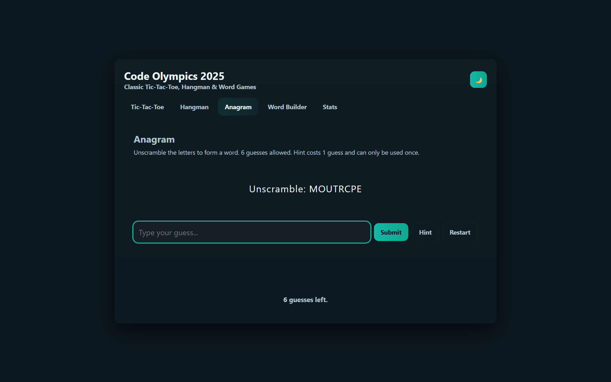 | 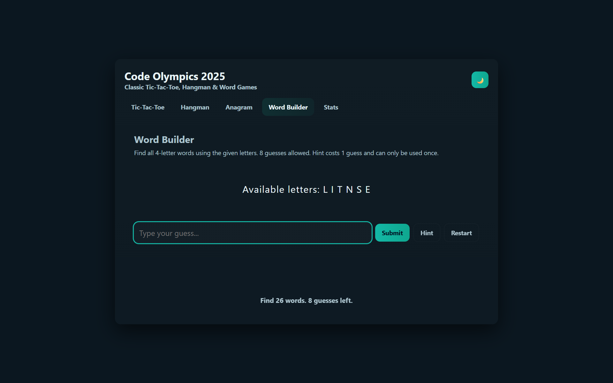 |
| **Stats** | **Mobile View** |
| 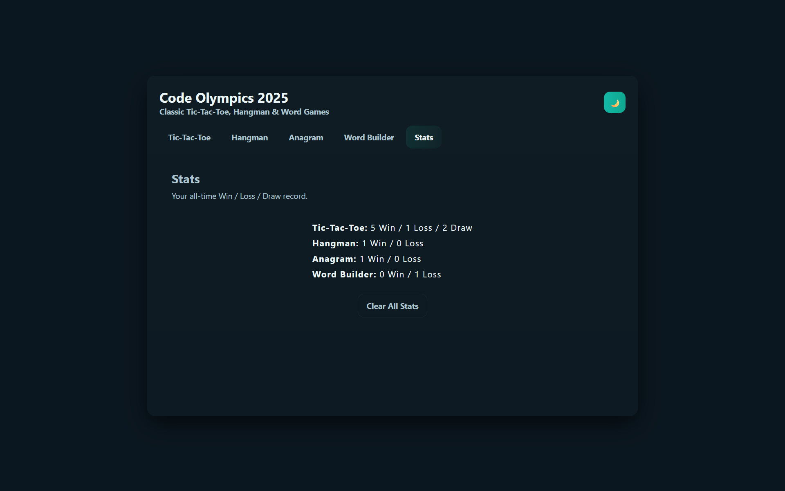 | 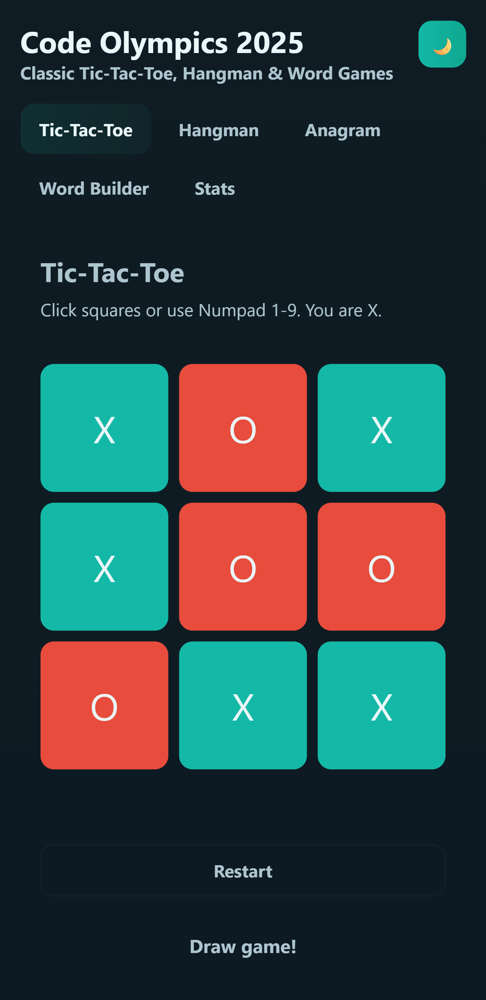 |

### Light Mode
| Tic-Tac-Toe | Hangman |
| :---: | :---: |
| 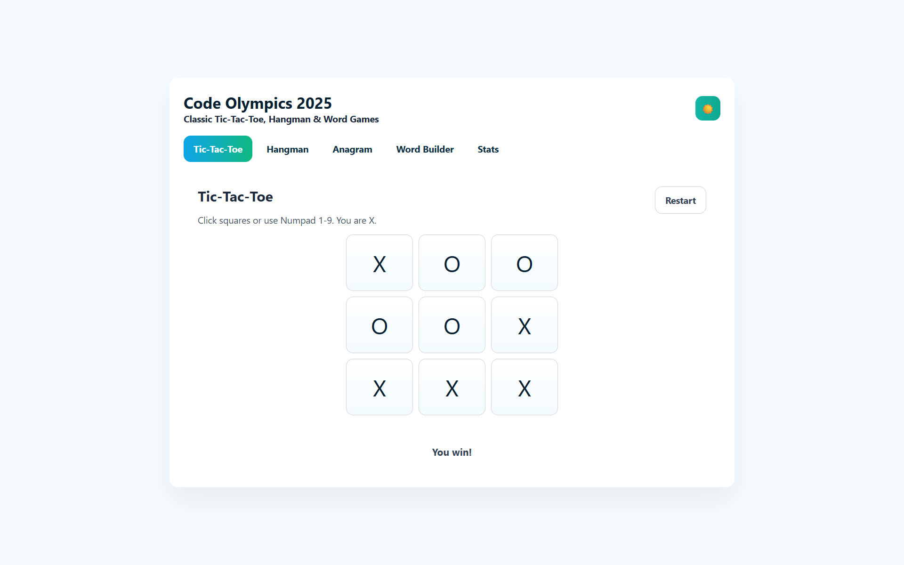 | 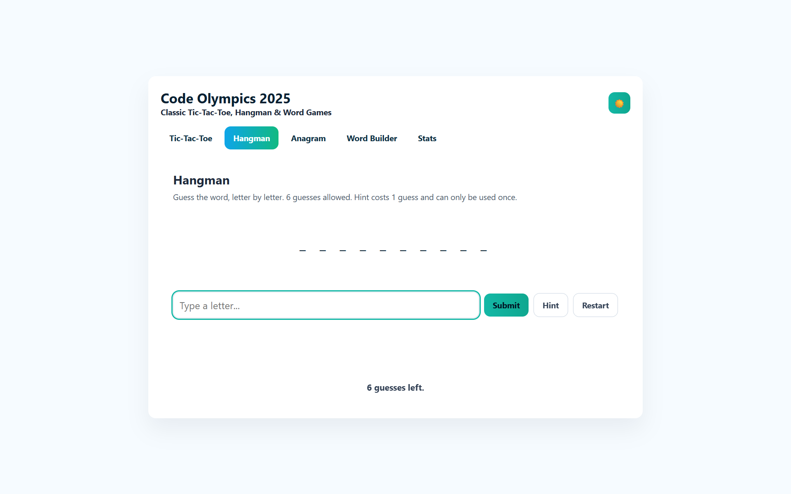 |
| **Anagram** | **Word Builder** |
| 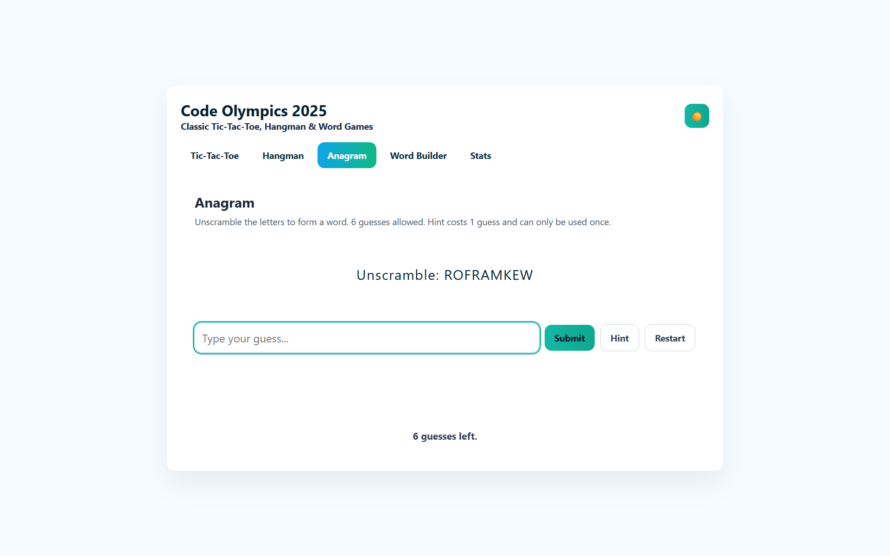 | 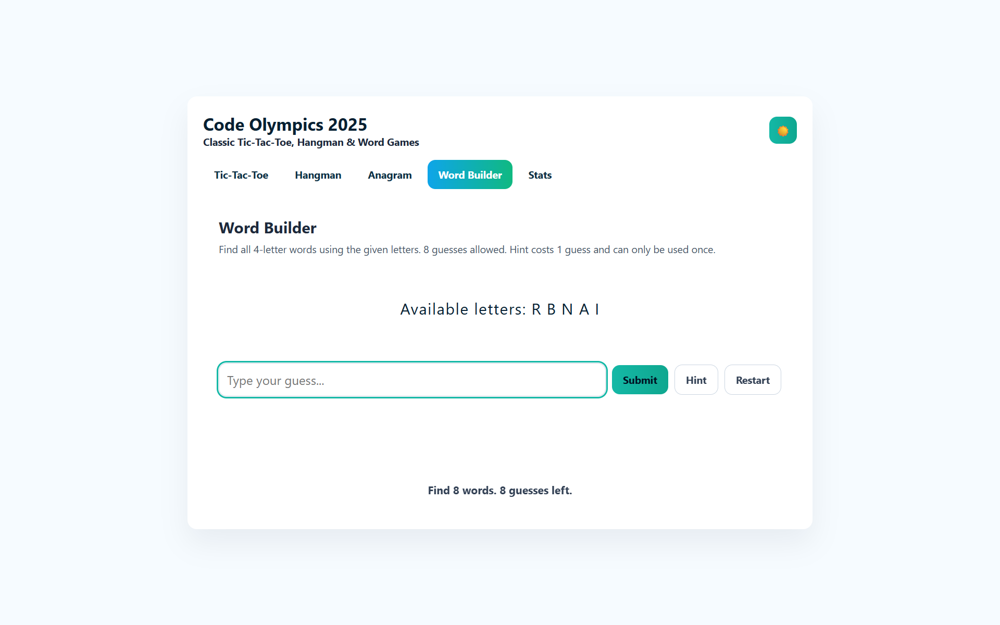 |
| **Stats** | **Mobile View** |
| 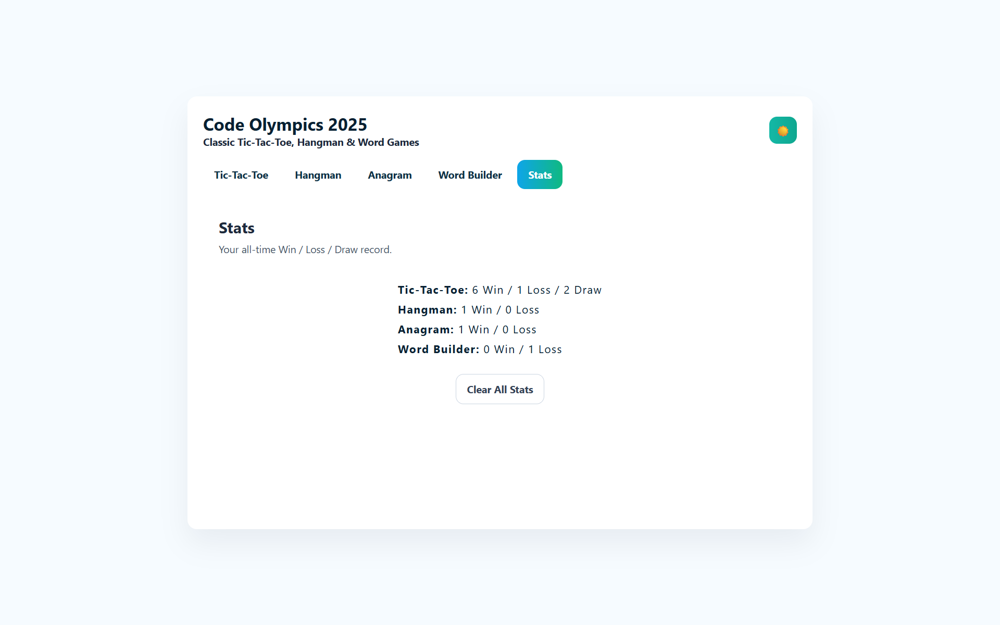 | 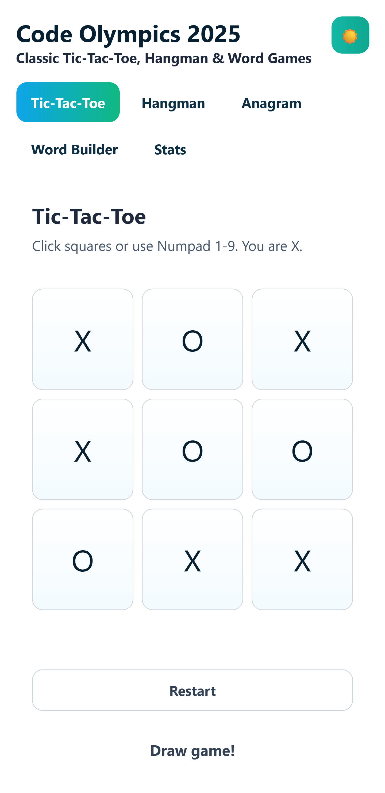 |

## 🏛️ Technical Architecture

The application was built with a 5-part, event-driven architecture, all within the single `index.html` file to meet the extreme constraints.

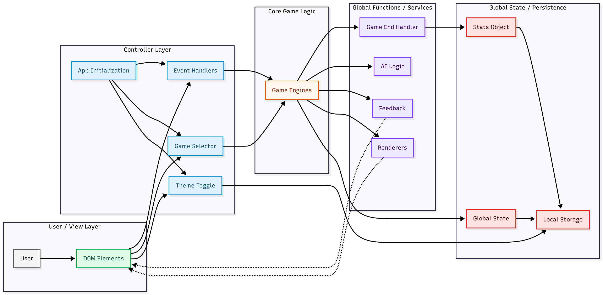

### Architecture Explained

1.  **User / View Layer (HTML):** The DOM elements (`E`) that receive user clicks, key presses, and input.
2.  **Controller Layer (JS):** Event listeners (`.click`, `.keydown`) and the main game selector function (`slc()`) that "listen" for user actions and route them.
3.  **Core Game Logic (JS):** The `d` (data) array, which holds a separate "engine" object (`.ini`, `.sub`) for each game. This is the "brain" that holds all game rules.
4.  **Global Functions / Services (JS):** A "toolbox" of shared, global functions (`upd`, `aim`, `end`, `ok`) that the game logic calls to perform common tasks like rendering, AI moves, or saving.
5.  **Global State / Persistence (JS):** Global variables (`g`, `sts`) for in-memory state and `localStorage` for persistent state (theme, stats, and last game).

## ⚙️ How to Run

1.  Download the `index.html` file.
2.  Open the `index.html` file in any modern web browser.

That's it. There are no dependencies, no builds, and no installs.
